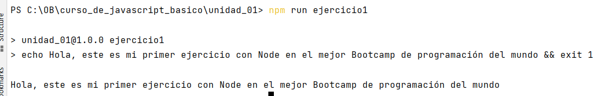

# OB_Curso_de_JavaScript_Basico
## Unidad 1 - Ejercicio 1

**Enunciado del ejercicio:**

Crea un nuevo proyecto de Node, y dentro del package.json crea un script 
que muestre por pantalla.

_"Hola, este es mi primer ejercicio con Node
en el mejor Bootcamp de programación del mundo"_.

### Consola:
```
npm run ejercicio1
```
### Ejercicio Print de Pantalla:

