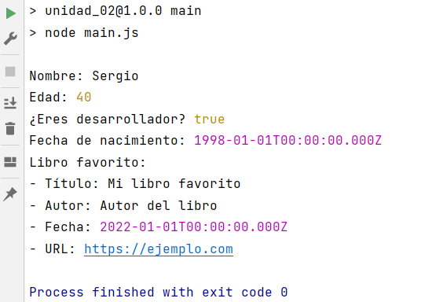

# OB_Curso_de_JavaScript_Basico
## Unidad 2 - Ejercicio 1

**Enunciado del ejercicio:**

Crea un nuevo archivo JS que contenga una lista con los siguientes elementos:

- Tu nombre (string)
- Tu edad (number)
- ¿Eres desarrollador? (boolean)
- Tu fecha de nacimiento (Date)
- Tu libro favorito (Objeto con propiedades: titulo, autor, fecha, url)

### Consola:
```
npm run main
```
### Ejercicio Print de Pantalla:

