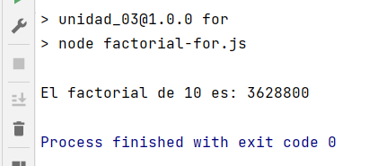
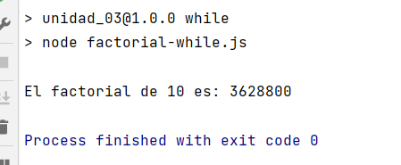
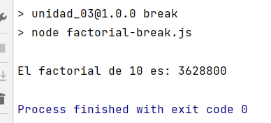

# OB_Curso_de_JavaScript_Basico
## Unidad 3 - Ejercicio 1

**Enunciado del ejercicio:**

Crea los siguientes archivos JS:

- factorial-for.js -> Este archivo debe calcular el factorial de 10 utilizando un solo bucle for
- factorial-while.js -> Este archivo debe calcular el factorial de 10 utilizando un bucle while
- factorial-break.js -> Este archivo debe calcular el factorial de 10 utilizando un bucle while, una bifurcación if y una sentencia break

### Consola:
```
npm run for
npm run while
npm run break
```
### Ejercicio Print de Pantalla:



