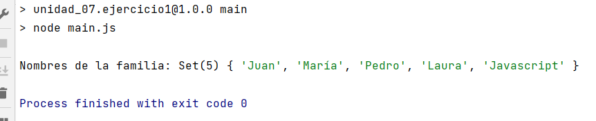

# OB_Curso_de_JavaScript_Basico
## Unidad 7 - Ejercicio 1

**Enunciado del ejercicio:**

Crea un archivo llamado main.js que contenga las siguientes líneas

- Un nuevo Set con los nombres de tu familia
- Modifica el Set original añadiendo tu nombre (duplicado) (debería darte lo mismo)
- Modifica el Set original añadiendo el nombre "Javascript" (ya que empieza a formar parte de tu vida ;)

### Consola:
```
npm run main
```
### Ejercicio Print de Pantalla:



