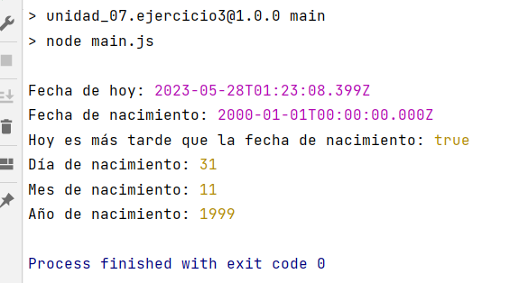

# OB_Curso_de_JavaScript_Basico
## Unidad 7 - Ejercicio 3

**Enunciado del ejercicio:**

Crea un archivo llamado main.js que contenga las siguientes líneas

- La fecha de hoy
- La fecha de tu nacimiento
- Un variable que indique si hoy es más tarde (>) que la fecha de tu nacimiento
- Una variable que contenga el día de tu nacimiento
- Una variable que contenga el mes de tu nacimiento (recuerda que Enero es mes 0)
- Una variable que contenga el año de tu nacimiento (con 4 dígitos)

### Consola:
```
npm run main
```
### Ejercicio Print de Pantalla:



