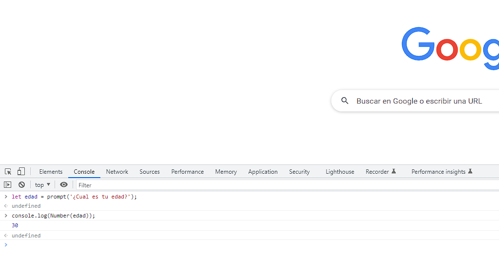

# OB_Curso_de_JavaScript_Basico
## Unidad 7 - Ejercicio 4

**Enunciado del ejercicio:**

Crea un archivo llamado main.js que contenga las siguientes líneas

- Abre una nueva ventana "about:blank" en Google Chrome
- Abre la consola de desarrollador de Google Chrome (F12)
- Pregunta al usuario cuál es su edad y almacénala en una variable llamada edad

### Ejercicio Print de Pantalla:

