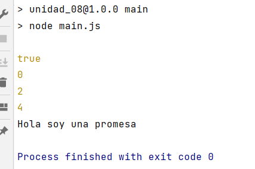

# OB_Curso_de_JavaScript_Basico
## Unidad 8 - Ejercicio 1

**Enunciado del ejercicio:**

Crea un archivo main.js que contenga las siguientes líneas

- Una función sin parámetros que devuelva siempre "true"
- Una función asíncrona que utilice un setTimeout y pase por consola 
  un "Hola soy una promesa" 5 segundos después de haberse ejecutado.
- Una función generadora de índices pares automáticos

### Consola:
```
npm run main
```
### Ejercicio Print de Pantalla:



