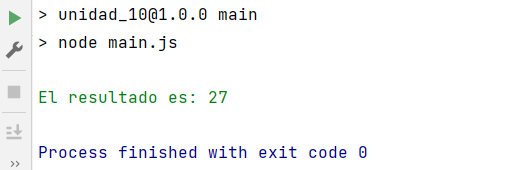

# OB_Curso_de_JavaScript_Basico
## Unidad 10 - Ejercicio 1

**Enunciado del ejercicio:**

Crea un nuevo proyecto de Node

- Configura el proyecto para utilizar los módulos de ES6
- Crea un archivo controller.js que exporte 2 funciones: suma(a, b) y multiplica(a, b)
- En el entrypoint main.js, importa el módulo controller.js
- El entrypoint main.js debe utilizar las funciones del módulo para devolver la multiplicación de suma(1, 2) y suma(4, 5)
- Instala e importa la librería chalk (https://www.npmjs.com/package/chalk)
- Modifica el último console.log del entrypoint main.js para devolver el resultado en color verde


### Consola:
```
npm run main
```
### Ejercicio Print de Pantalla:



