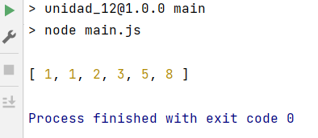

# OB_Curso_de_JavaScript_Basico
## Unidad 12 - Ejercicio 1

**Enunciado del ejercicio:**

Crea un nuevo fichero main.js que contenga las siguientes líneas

- Una función que admita un parámetro "num", y devuelva una lista 
  con esa cantidad de números de la secuencia de Fibonacci (Por ejemplo: num = 6 => Resultado [1, 1, 2, 3, 5, 8])
- Ejecuta la depuración de VSCode para visualizar la ejecución de la función

### Consola:
```
npm run main
```
### Ejercicio Print de Pantalla:



