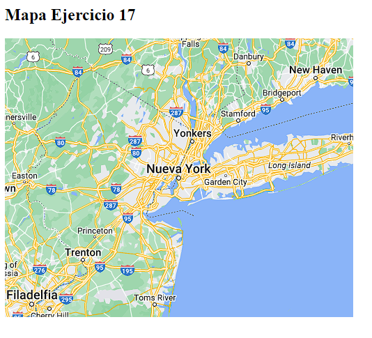

# OB_Curso_de_JavaScript_Basico
## Unidad 17 - Ejercicio 1

**Enunciado del ejercicio:**

- Crea un mapa en HTML
- Pon chinchetas en tus 3 lugares favoritos del planeta tierra


### Consola:
```
npm run main
```
### Ejercicio Print de Pantalla:



